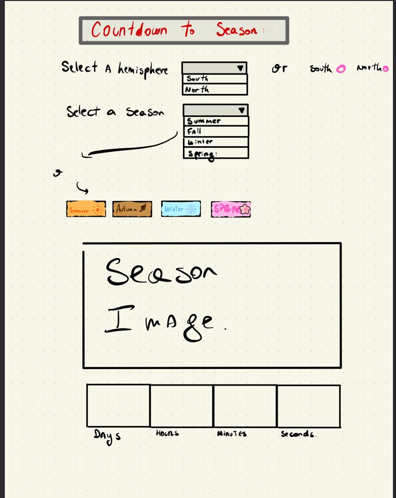

Seasons Countdown

I usually am looking forward to the day that the seasons change, usually i would search for the date in Google. So i decided to do this project as practice to learn more about HTML, CSS and JS.

I still want to make this project web responsive in the next weeks (Today is 04/25/22).

## The first Sketch

At first I didnt know if i was going to use CheckBox or a dropdown menu. But I am really happy with the result to Date.

## Link of Deployment

You can see the project here: (https://super-kringle-3141a3.netlify.app)